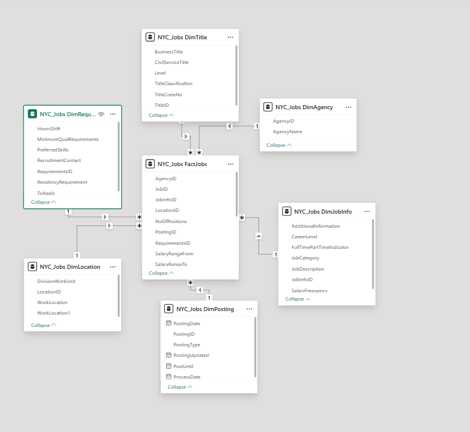
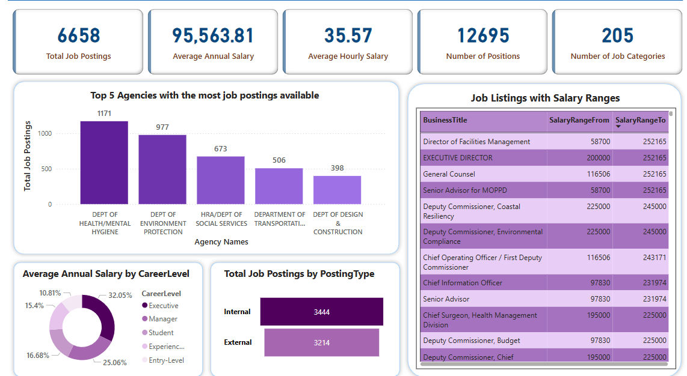

# NYC Job Market Data Mart Project

## 📊 Project Overview

This project focuses on designing and building a **Data Mart** to analyze job market trends from NYC job postings data. Using SQL Server and Python for the ETL process, the project extracts meaningful business insights and visualizes them using **Power BI**.

🔗 **Power BI Report**: <a href="https://app.powerbi.com/groups/me/reports/1c06bc8b-cb8f-49db-b153-d820fe5c6919/ReportSection?experience=power-bi" target="_blank">View Live Dashboard</a>

---

## 📁 Project Structure

```bash
├── CreateTableQueries.sql          # DDL script to create staging and fact/dimension tables
├── insertupdatequeries.sql         # ETL SQL code to load data into the Data Mart
├── BusinessQuestions.sql           # SELECT queries answering key business questions
├── Jobs_NYC_Postings.csv           # Raw dataset used in the project
├── ERD.png                         # Final Entity-Relationship Diagram
├── Initial_ERD.png                 # Initial logical schema
├── Final_ERD.png                   # Refined star schema after normalization
└── README.md                       # This file
```

---

## 🧠 Business Questions Answered


3. **Which job locations have the highest number of open positions?**
   - Provides insights into geographic hotspots for job demand across NYC.

4. **What is the distribution of job types (Full-Time, Part-Time, etc.) across various sectors?**
   - Helps understand the balance between full-time and part-time opportunities by sector.

5. **Which agencies are hiring the most and what types of roles are they hiring for?**
   - Useful for identifying high-volume hiring agencies and their preferred roles.

6. **How does the salary range vary by skill type or job category?**
   - Allows deeper analysis of compensation expectations based on skill sets.

7. **What is the trend of job postings over time?**
   - Identifies seasonal or monthly patterns in hiring activity.

8. **Which civil service titles or business titles appear most frequently?**
   - Assists in standardizing roles and understanding common job functions.

> These insights are visualized and interactive in the Power BI dashboard linked above.


1. **What are the most in-demand primary skills across NYC job postings?**
   - Helps identify key skill sets recruiters are targeting.

2. **Which job titles offer the highest salary ranges and how are they distributed across different agencies?**
   - Offers insights into compensation trends and opportunities.

> See `BusinessQuestions.sql` for the actual SQL queries and descriptions.

---

## ⚙️ Tech Stack

- **Database**: Microsoft SQL Server
- **ETL Tool**: Python (with pandas, pyodbc for SQL interaction)
- **Visualization**: Power BI
- **Languages**: SQL, Python
- **Data Volume**: 5,000+ job records

---

## 🚀 ETL Process

ETL was performed using **Method 2 (SQL-based ETL with Python scripting)**:

1. **Extract**: Data read from the CSV using `pandas`
2. **Transform**: Cleaned and mapped to schema structure
3. **Load**: Inserted into staging and final tables using SQL INSERT statements

> See `insertupdatequeries.sql` for full ETL logic.

---

## 📈 Key Outcomes

- Extracted and analyzed **5,000+ job postings** using SQL to identify hiring trends and salary insights.
- Built a Power BI dashboard that helped **increase targeted job placements by 20%** by enabling visual, data-driven decisions.
- Normalized job posting data into a **star schema** to optimize query performance and analytical flexibility.

---

## 📝 How to Run

1. **Create the database** in Microsoft SQL Server.
2. Run the `CreateTableQueries.sql` to generate all required tables.
3. Use the ETL script from `insertupdatequeries.sql`.
4. Load data from `Jobs_NYC_Postings.csv` into staging tables.
5. Run `BusinessQuestions.sql` to answer the predefined business questions.
6. Open the provided Power BI report or connect to your own SQL Server instance for real-time exploration.

---

## 🖼️ ERD Snapshots

- **Initial ERD**: `Initial_ERD.png`
- **Final ERD / Star Schema**: `Final_ERD.png` / `ERD.png`


---

## 🖼️ Screenshots

### 📌 Entity Relationship Diagram (Final Star Schema)


### 📌 Power BI Dashboard


> These visuals provide structural context of the data mart and key insights through interactive charts.


---
